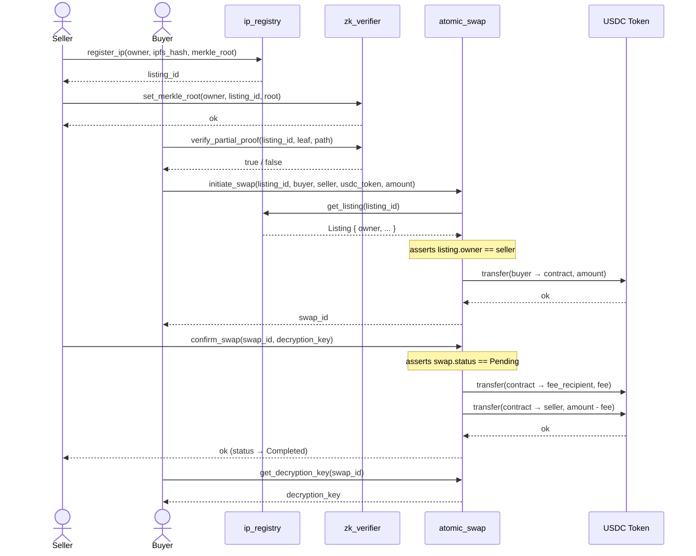
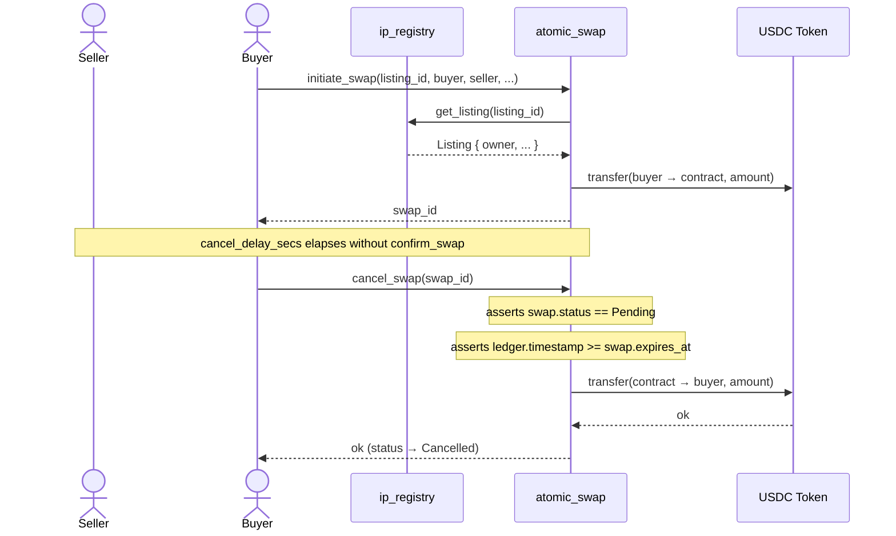

# Architecture: Sequence Diagrams

## Swap Lifecycle & ZK Proof Flow

The full happy-path flow spans three contracts: `ip_registry`, `zk_verifier`, and `atomic_swap`.



---

## Cancel / Refund Flow

If the seller never calls `confirm_swap` before the timeout, the buyer can reclaim their USDC.



## Escrow Hold Period

After a swap is completed (the seller submits the decryption key), the seller's
payout can be held for an additional, **seller-configurable** window layered on
top of the dispute window. This gives an honest buyer time to verify the
delivered IP before funds move, and lets a reputable seller advertise a buyer
protection window.

### Economics & rationale

- **Default: 24 hours** (`DEFAULT_HOLD_PERIOD_SECS = 86_400`). Applied when a
  seller enables holds without choosing a custom value.
- **Per-seller configuration.** A seller calls `set_seller_hold_period(seller,
  secs)`. A value of `0` opts out entirely. Sellers competing for buyers can
  offer a longer hold as a trust signal; sellers who want faster settlement can
  shorten or disable it.
- **Global default.** The admin may enable holds protocol-wide and set the
  default via `set_escrow_hold_config(enabled, default_secs)`. A per-seller
  override always wins over the global default.
- **Buyer confirmation override.** Once satisfied, the buyer calls
  `confirm_receipt(swap_id)` to waive the remaining hold, so the seller is paid
  immediately. This keeps a cooperative buyer from needlessly delaying an
  honest seller while still defaulting to buyer protection.

### Security properties

- **No manipulation after the fact.** `hold_until` is snapshotted at
  `confirm_swap` time from the seller's then-current configuration. Changing the
  per-seller or global setting afterwards cannot shorten or extend the hold on a
  swap that is already in progress.
- **Bounded duration.** Both setters reject values above
  `MAX_HOLD_PERIOD_SECS = 2_592_000` (30 days), preventing a hold from locking
  buyer funds indefinitely.
- **Authorization.** Only the buyer can call `confirm_receipt`; only the seller
  can set their own hold period; only the admin can change the global default.
- **Independent gate.** `release_to_seller` enforces the hold (error
  `HoldPeriodActive`) in addition to the dispute window — both must clear before
  funds are released, unless the buyer has confirmed receipt.

### Audit trail

`SellerHoldPeriodUpdated`, `EscrowHoldConfigUpdated`, and `BuyerConfirmedReceipt`
events provide an on-chain record of configuration changes and early-release
authorizations. The `hold_period_active(swap_id)` view returns whether a swap's
funds are currently time-locked, which the UI surfaces via `HoldPeriodDisplay`.

```mermaid
sequenceDiagram
    actor Seller
    actor Buyer
    participant AtomicSwap as atomic_swap
    participant USDC as USDC Token

    Seller->>AtomicSwap: set_seller_hold_period(seller, 86400)
    Note over AtomicSwap: bounded by MAX_HOLD_PERIOD_SECS

    Seller->>AtomicSwap: confirm_swap(swap_id, key, proof)
    Note over AtomicSwap: status → Completed; hold_until = now + hold_secs

    alt Buyer confirms receipt early
        Buyer->>AtomicSwap: confirm_receipt(swap_id)
        Note over AtomicSwap: buyer_confirmed = true (hold waived)
    else Hold period elapses
        Note over AtomicSwap: ledger.timestamp >= hold_until
    end

    Seller->>AtomicSwap: release_to_seller(swap_id)
    Note over AtomicSwap: requires dispute window cleared AND hold not active
    AtomicSwap->>USDC: transfer(contract → seller, amount − fees)
    AtomicSwap-->>Seller: ok (status → ResolvedSeller)
```

## Fee & Royalty Bounds

At settlement (`release_to_seller` and the seller-favoring branch of dispute
resolution), the seller receives `usdc_amount − protocol_fee − royalty`. Both
`fee_bps` (`atomic_swap` config) and `royalty_bps` (a listing's `ip_registry`
field) are independently bounded to `<= 10_000` (100%), but they live in two
separate contracts and are set at different times — a listing can be created
long before an admin later raises `fee_bps` via `update_config`.

- **Enforced invariant:** at settlement time, `fee_bps + effective_royalty_bps
  <= 10_000` always holds, so `seller_amount` can never go negative and the
  transfer can never panic.
- **Clamping, not rejection.** Because `update_config` cannot retroactively
  re-validate every existing listing (and shouldn't — it isn't the right layer
  to iterate storage), the combined-bps budget is enforced where it is
  actually spent: `effective_royalty_bps = min(listing.royalty_bps, 10_000 -
  config.fee_bps)`. Royalty is still computed on the gross sale price
  (`usdc_amount`), independent of the fee — clamping only caps how much of
  that budget the royalty portion can claim once the protocol fee has taken
  its share.
- **Auditability.** If a later fee change forces a listing's effective royalty
  below its nominal `royalty_bps`, a `RoyaltyClamped` event is published with
  both the nominal and effective values, so the degradation is visible
  off-chain even though settlement itself never fails.
- **Overflow-safe arithmetic.** Both the fee and royalty computations use
  `checked_mul`/`checked_div` against 10,000 (matching pattern), panicking
  with `ContractError::Overflow` rather than wrapping silently.
